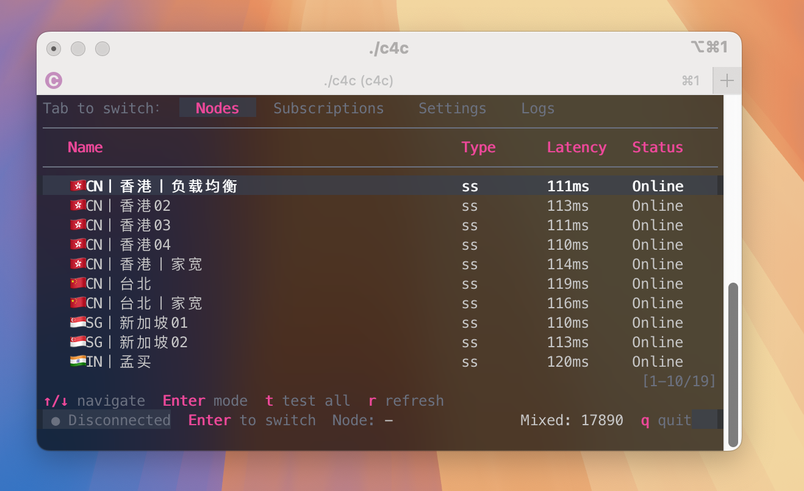

[🇺🇸 English](README.md) | [🇨🇳 简体中文](README.zh-CN.md) | [🇨🇳 繁體中文](README.zh-TW.md) | [🇷🇺 Русский](README.ru-RU.md) | [🇯🇵 日本語](README.ja-JP.md) | [🇰🇷 한국어](README.ko-KR.md) | [🇪🇸 Español](README.es-ES.md) | [🇧🇷 Português (Brasil)](README.pt-BR.md) | [🇫🇷 Français](README.fr-FR.md) | [🇩🇪 Deutsch](README.de-DE.md) | [🇮🇹 Italiano](README.it-IT.md) | [🇮🇩 Bahasa Indonesia](README.id-ID.md) | [🇻🇳 Tiếng Việt](README.vi-VN.md) | [🇹🇷 Türkçe](README.tr-TR.md)

# 🚀 Clash for CLI
**O melhor cliente Clash multiplataforma para CLI.**



## 🤩 Principais recursos:
* Sem configuração, pronto para usar.
* **Suporte moderno a assinaturas**
* Alimentado pelo kernel [mihomo](https://github.com/MetaCubeX/mihomo)
* **Sem root**
* Use `c4cgo` para executar qualquer comando via proxy
* Multiplataforma para Linux e macOS
## 📦 Instalação
Baixe os binários em [GitHub Releases](https://github.com/ashlynn-free/clash4cli/releases) e execute.


## 🧭 Uso básico

### Iniciar o painel
```bash
./c4c
```

Na UI, adicione/selecione uma assinatura e escolha um nó para conectar.

- Porta mixed padrão: `17890` (configurável em Settings)
- O core roda em segundo plano; sair do `c4c` **não** o interrompe
- Para parar: vá em Nodes e pressione `Enter` até `Disconnect`

### `c4cgo`

`c4cgo` usa automaticamente o ambiente de proxy criado pelo c4c. Este recurso é baseado no [proxychians-ng](https://github.com/rofl0r/proxychains-ng)

Exemplo: executar `curl` via proxy

```bash
./c4cgo curl ipinfo.io
```

Saída de exemplo:

```text
[c4cgo] Using proxy at 127.0.0.1:17890 (node: SG node)
[c4cgo] Mode: proxychains4
[c4cgo] Proxy: socks5://127.0.0.1:17890
[c4cgo] Command: curl
─────────────────────────────────────
{
  "ip": "***.***.***.***",
  "city": "Singapore",
  "region": "Singapore",
  "country": "SG",
  "loc": "1.2897,103.8501",
  "org": "AS38136 Akari Networks",
  "postal": "018989",
  "timezone": "Asia/Singapore",
  "readme": "https://ipinfo.io/missingauth"
}
```

## 🗂️ Diretório de dados

Padrão: `~/.clash4cli/` (inclui `config.yaml`, `proxy.lock`, `subscriptions/`, `mihomo/`, etc.).
